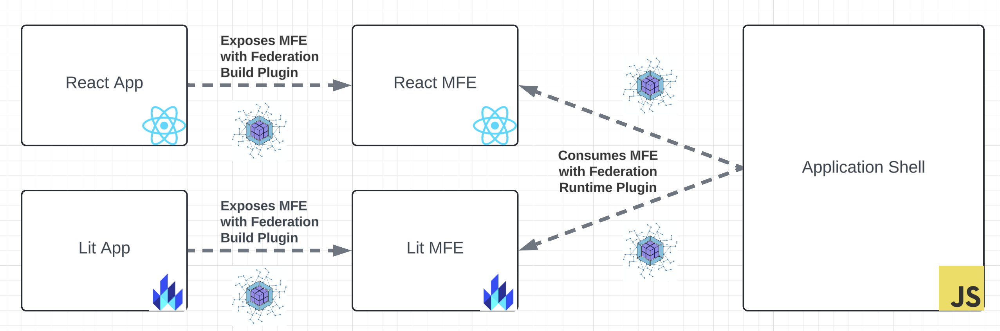

# About



This repo contains an App Shell called 'shell' and two micro frontends; 'react-mfe' and 'lit-mfe'

The App Shell is built with vanilla javascript and Federation Runtime.

The App Shell uses Federation Runtime to consume react-mfe and lit-mfe. (shell/bootstrap.ts)

Both react-mfe and lit-mfe expose the same MFE API. (MFE.ts)

The standardized MFE API contains methods for mounting, bootstrapping, and destroying an MFE. (MFE.ts)

The Application shell calls these methods on MFE modules during the user journey to switch between MFEs as necessary. (shell/bootstrap.ts)

## Up and Running

### Install Dependencies

From project root:

```shell
$ npm i
```

### Start Development Servers

From project root:

```shell
$ npm run dev
```

Or from package root:

```shell
$ cd packages/$PACKAGE_NAME && npm run dev
```
